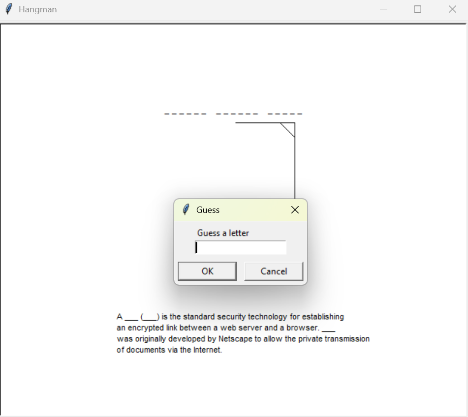

# Hello there, I'm Patrick Johnson

I'm a data analytics student at Walsh University. My studies focus primarily on statistics and programming, but I have some knowledge in a wide array of fields such as database technology, accounting and machine learning models. I focus on learning systems in order to provide clear, business-pertinent analyses 

## Technologies, tools and techniques:
  -  **Languages**: Python, PostgreSQL
  -  **Currently learning**: R
  -  **Tools**: VS Code, Git, GitHub, Excel, PGAdmin
  -  **Skills**: Oral and written communication, statistics, 

## What I'm currently working on:
  - Creating a personal portfolio
  - Research on population statistics for my undergraduate thesis

## Featured projects:

### Instructive Hangman game

An interactive game that explained computer security concepts through guessing a word with a given description, similar to flashcards. Built to practice working with user input, graphical packages such as Turtle, and text comprehension.

## Technologies & Packages:
Python
- turtle
- string
- random

## Setup:
- Clone the repository
- Ensure Python packages turtle, string and random are imported
- Run the code on a local Python interpreter

## Preview:

### K-Means clustering

This was an analysis of warranty claims data provided as part of a class. I determined the optimal type of clustering for use on the project and summarized my findings regarding what items were returned most often and what suppliers had items most commonly returned.

## Technologies & Packages:
Python
- pandas
- sklearn
- matplotlib
- scipy

## Setup:
- Clone the repository, ensuring that the dataset is loaded into the same folder
- Import required packages
- Run the code on a local Python interpreter

### Optimized algorithm for longest nonrepeating subsequence

In this, I created an optimized algorithm to find the length of the longest sequence of characters in a string without any repeating characters. I was able to reduce the time complexity from O(n^2) to O(n) through a windowed view of the string.

## Technologies & Packages:
Python

## Setup:
- Run the code, inserting test strings at the end as desired

## Let's connect:
  - **LinkedIn**: www.linkedin.com/in/patrick-johnson-5a1858382
  - **Email**: patrick.joseph.albert.johnson@gmail.com
